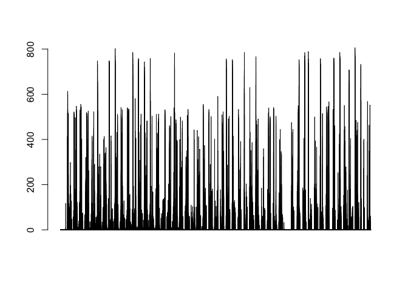
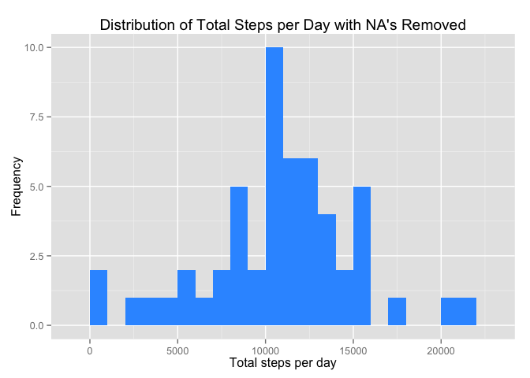
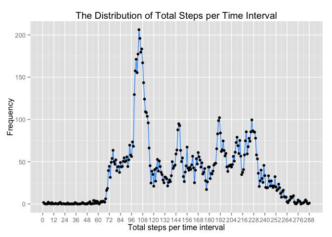
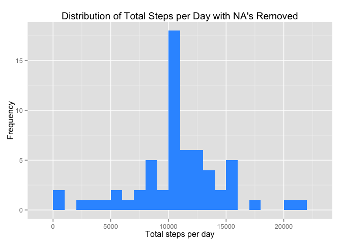
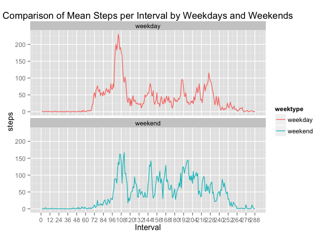

# Reproducible Research: Peer Assessment 1
**Introduction**
It is now possible to collect a large amount of data about personal movement using activity monitoring devices such as a Fitbit, Nike Fuelband, or Jawbone Up. These type of devices are part of the “quantified self” movement – a group of enthusiasts who take measurements about themselves regularly to improve their health, to find patterns in their behavior, or because they are tech geeks. But these data remain under-utilized both because the raw data are hard to obtain and there is a lack of statistical methods and software for processing and interpreting the data.
This assignment makes use of data from a personal activity monitoring device. This device collects data at 5 minute intervals through out the day. The data consists of two months of data from an anonymous individual collected during the months of October and November, 2012 and include the number of steps taken in 5 minute intervals each day.

**Data**
The data for this assignment can be downloaded from the course web site:
•  Dataset: Activity monitoring data [52K]
The variables included in this dataset are:
•	steps: Number of steps taking in a 5-minute interval (missing values are coded asNA)
•	date: The date on which the measurement was taken in YYYY-MM-DD format
•	interval: Identifier for the 5-minute interval in which measurement was taken
The dataset is stored in a comma-separated-value (CSV) file and there are a total of 17,568 observations in this dataset.

**Assignment**
This assignment will be described in multiple parts. You will need to write a report that answers the questions detailed below. Ultimately, you will need to complete the entire assignment in a single R markdown document that can be processed by knitr and be transformed into an HTML file.

Throughout your report make sure you always include the code that you used to generate the output you present. When writing code chunks in the R markdown document, always use echo = TRUE so that someone else will be able to read the code. This assignment will be evaluated via peer assessment so it is essential that your peer evaluators be able to review the code for your analysis.

## Loading and preprocessing the data 


```r
require(dplyr)
```

```
## Loading required package: dplyr
## 
## Attaching package: 'dplyr'
## 
## The following objects are masked from 'package:stats':
## 
##     filter, lag
## 
## The following objects are masked from 'package:base':
## 
##     intersect, setdiff, setequal, union
```

```r
require(ggplot2)
```

```
## Loading required package: ggplot2
```

```r
require(data.table) 
```

```
## Loading required package: data.table
## 
## Attaching package: 'data.table'
## 
## The following objects are masked from 'package:dplyr':
## 
##     between, last
```

```r
if(!file.exists("repdata-data-activity.zip")) {
  url <- "http://d396qusza40orc.cloudfront.net/repdata%2Fdata%2Factivity.zip"
  download.file(url, "repdata-data-activity.zip", mode="wb")
  file <- unzip("repdata-data-activity.zip")}
  file <- unzip("repdata-data-activity.zip")
  
activity <- read.csv(file, header=TRUE)
data <- activity
```

Explore

```r
names(data)
```

```
## [1] "steps"    "date"     "interval"
```

```r
head(data)
```

```
##   steps       date interval
## 1    NA 2012-10-01        0
## 2    NA 2012-10-01        5
## 3    NA 2012-10-01       10
## 4    NA 2012-10-01       15
## 5    NA 2012-10-01       20
## 6    NA 2012-10-01       25
```

```r
str(data)
```

```
## 'data.frame':	17568 obs. of  3 variables:
##  $ steps   : int  NA NA NA NA NA NA NA NA NA NA ...
##  $ date    : Factor w/ 61 levels "2012-10-01","2012-10-02",..: 1 1 1 1 1 1 1 1 1 1 ...
##  $ interval: int  0 5 10 15 20 25 30 35 40 45 ...
```

```r
data$interval <- as.factor(data$interval)
sum(is.na(data$steps))
```

```
## [1] 2304
```

```r
summary(data)
```

```
##      steps                date          interval    
##  Min.   :  0.00   2012-10-01:  288   0      :   61  
##  1st Qu.:  0.00   2012-10-02:  288   5      :   61  
##  Median :  0.00   2012-10-03:  288   10     :   61  
##  Mean   : 37.38   2012-10-04:  288   15     :   61  
##  3rd Qu.: 12.00   2012-10-05:  288   20     :   61  
##  Max.   :806.00   2012-10-06:  288   25     :   61  
##  NA's   :2304     (Other)   :15840   (Other):17202
```
Remove NAs from table

```r
data2 <- data %>%
  filter(!is.na(steps))
summary(data2)
```

```
##      steps                date          interval    
##  Min.   :  0.00   2012-10-02:  288   0      :   53  
##  1st Qu.:  0.00   2012-10-03:  288   5      :   53  
##  Median :  0.00   2012-10-04:  288   10     :   53  
##  Mean   : 37.38   2012-10-05:  288   15     :   53  
##  3rd Qu.: 12.00   2012-10-06:  288   20     :   53  
##  Max.   :806.00   2012-10-07:  288   25     :   53  
##                   (Other)   :13536   (Other):14946
```

```r
barplot(data2$steps)
```

 

## What is mean total number of steps taken per day?

To determine the mean number of steps per day the dataset is grouped by days with NA values removed, then the mean and median are taken from this dataset.

```r
dateTotal <- data %>%
  filter(!is.na(steps)) %>%
  group_by(date) %>%
  summarize(steps = sum(steps))

mean1 <- round(mean(dateTotal$steps), 0)
median1 <- median(dateTotal$steps)
```
Mean number of steps: 

```r
mean1
```

```
## [1] 10766
```
Median number of steps: 

```r
median1
```

```
## [1] 10765
```

Histogram of the total number of steps taken each day:

```r
ggplot(dateTotal, aes(x = steps)) +
  geom_histogram(fill = "#3399FF", binwidth = 1000) +
  labs(title = "Distribution of Total Steps per Day with NA's Removed", 
       x = "Total steps per day", y = "Frequency")
```

 

Difference between the mean and median 

```r
mean1 - median1
```

```
## [1] 1
```

## What is the average daily activity pattern?

Below is a time series plot showing 5-minute interval on the x-axis with labels every hour and the average number of steps taken on the y-axis.

```r
timeTotal <- data2 %>% 
              group_by(interval) %>%
              summarise(avg = mean(steps))
head(timeTotal)
```

```
## Source: local data frame [6 x 2]
## 
##   interval       avg
##     (fctr)     (dbl)
## 1        0 1.7169811
## 2        5 0.3396226
## 3       10 0.1320755
## 4       15 0.1509434
## 5       20 0.0754717
## 6       25 2.0943396
```

```r
# change timeTotal$interval to numeric so the x axis of the plot can be manipulated 
timeTotalasNum <- timeTotal
timeTotalasNum$interval <- as.numeric(timeTotalasNum$interval)

ggplot(timeTotalasNum, aes(x = interval, y = avg))+
  geom_line(aes(group=1), colour = "#3399FF") +     # Group all points; otherwise no line will show
  scale_x_continuous(breaks=c(seq(from=0, to=288, by=12)),
                     labels=c(seq(from=0, to=288, by=12))) +
  geom_point(size=2) +
  labs(title = "The Distribution of Total Steps per Time Interval", 
       x = "Total steps per time interval", y = "Frequency")
```

 
The 5 minute interval with the highest number of steps is number 835 which has approximently 10 more steps on average than the next closest interval which is number 840.

```r
timeTotal %>%
  top_n(n=2)
```

```
## Selecting by avg
```

```
## Source: local data frame [2 x 2]
## 
##   interval      avg
##     (fctr)    (dbl)
## 1      835 206.1698
## 2      840 195.9245
```

## Imputing missing values

This dataset includes a number of days/intervals where there are missing values (coded as NA). The presence of this missing days may introduce bias into some of the calculations or summaries of the data, so lets replace the missing values in the datset and compare it to our prevouis statistics to determine its impact.

There is a total of 2304 intervals which are missing values in the data sets.

```r
sum(is.na(data$steps))
```

```
## [1] 2304
```

Let's replace the missing values in the dataset with the mean value for each given time period.

```r
dt1<- data.table(data)
dt2 <- data.table(timeTotal)
dt1[is.na(steps), steps:= dt2[copy(.SD), avg, on="interval"]]
```

```
## Warning in `[.data.table`(dt1, is.na(steps), `:=`(steps, dt2[copy(.SD), :
## Coerced 'double' RHS to 'integer' to match the column's type; may have
## truncated precision. Either change the target column to 'double' first (by
## creating a new 'double' vector length 17568 (nrows of entire table) and
## assign that; i.e. 'replace' column), or coerce RHS to 'integer' (e.g. 1L,
## NA_[real|integer]_, as.*, etc) to make your intent clear and for speed. Or,
## set the column type correctly up front when you create the table and stick
## to it, please.
```

```r
head(dt1)
```

```
##    steps       date interval
## 1:     1 2012-10-01        0
## 2:     0 2012-10-01        5
## 3:     0 2012-10-01       10
## 4:     0 2012-10-01       15
## 5:     0 2012-10-01       20
## 6:     2 2012-10-01       25
```

Then the steps per day are calculated and a histogram showing the total steps per day is generated.

```r
dt3 <- dt1[, sum(steps), by = date]
colnames(dt3)[2] <- "steps"
mean2 <- round(mean(dt3$steps), 0)
median2 <- median(dt3$steps)

ggplot(dt3, aes(x = steps)) +
  geom_histogram(fill = "#3399FF", binwidth = 1000)+
  labs(title = "Distribution of Total Steps per Day with NA's Removed", 
       x = "Total steps per day", y = "Frequency")
```

 

Finally, let's compare the two datasets in the table below to determine the difference between the mean and median with NA's included and with NA's replaced.  The difference between means is less than two tenths of a percent and the differnce between the meidans is just over one percent, so replacing the NAs in the dataset did not have much impact on these statistics.  

```r
labels <- c("NA's included", "NAs replaced", "Difference")
mean_diff <- paste(round(((mean1/mean2 - 1)*100), 2), "%", sep="")
median_diff <- paste(round(((median1/median2 - 1)*100), 2),"%", sep="")
means <- c(mean1, mean2, mean_diff)
medians <- c(median1, median2, median_diff)
comparison <- table(c(means, medians))

data.frame(labels, means, medians)
```

```
##          labels means medians
## 1 NA's included 10766   10765
## 2  NAs replaced 10750   10641
## 3    Difference 0.15%   1.17%
```

## Are there differences in activity patterns between weekdays and weekends?

To determine the difference a new factor variable in the dataset is created with two levels – “weekday” and “weekend” indicating whether a given date is a weekday or weekend day.

```r
dt1$date<- as.Date(dt1$date)
df4 <- mutate(dt1, weektype = ifelse(weekdays(date) == "Saturday" 
                                         | weekdays(date) == "Sunday", 
                                         "weekend", "weekday"))
```

Then a panel plot is generated to show the compairson between the average number of steps taken, averaged across all weekday days and weekend days.  The plots below indicate that during the week the the mornings are very active, however during typical work hours (9am-5pm) activity is significantly reduced and picks up slightly during the evening hours.  On the weeknds, while there is activity in the mornings it is not as much as during the week, however the activity for the rest of the day appears to be higher than during the week.  

```r
df5 <- df4 %>%
  group_by(interval, weektype) %>%
  summarise(steps = mean(steps))

s <- ggplot(df5, aes(x = as.integer(interval), y = steps, color = weektype)) +
      geom_line() +
      facet_wrap(~weektype, ncol = 1, nrow=2) + 
      scale_x_continuous(limits = c(0, 288),
                         breaks = c(seq(from=0, to=288, by=12)),
                         labels = c(seq(from=0, to=288, by=12))) +
      labs(title = "Comparison of Mean Steps per Interval by Weekdays and Weekends",
           x = "Interval", "Number of Steps", legend = "Weektype")
print(s)
```

 
